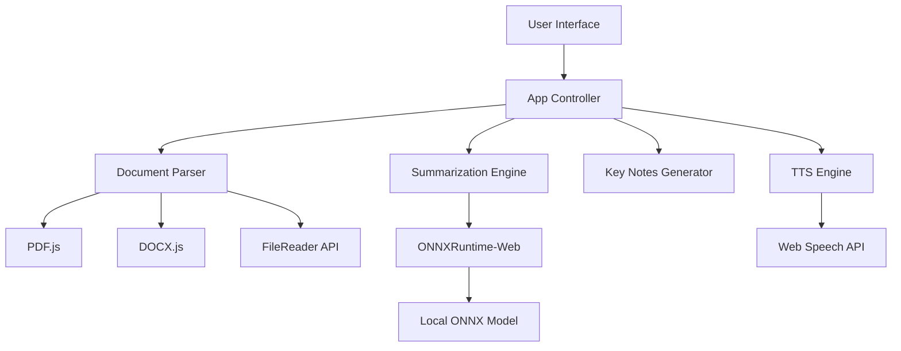

# Design Document

## Overview

Reado is a client-side web application that transforms documents into an interactive audio experience. The architecture is built entirely on browser-native APIs and local machine learning models, ensuring zero external dependencies, complete privacy, and no operational costs. The system follows a modular design with clear separation between document parsing, AI processing, and user interface layers.

## Architecture

### High-Level Architecture



### Technology Stack

- **Frontend Framework**: Vanilla JavaScript (ES6+)
- **Styling**: TailwindCSS via CDN
- **PDF Processing**: PDF.js library
- **DOCX Processing**: docx.js (mammoth.js) library
- **AI Inference**: ONNXRuntime-Web with T5-small or DistilBART-ONNX model
- **Text-to-Speech**: Web Speech API (SpeechSynthesis)
- **Build Tool**: None required (static files)

### Zero-Cost Architecture Principles

1. **No Backend**: All processing occurs in the browser
2. **No Cloud APIs**: ONNX models run locally via WebAssembly
3. **No Database**: State managed in memory only
4. **No Authentication**: No user accounts or sessions
5. **Static Hosting**: Deployable to GitHub Pages, Netlify, or any static host

## Components and Interfaces

### 1. Document Parser Module (`documentParser.js`)

**Responsibilities:**
- Accept file uploads
- Detect file type
- Extract text from PDF, DOCX, and TXT files
- Handle extraction errors

**Interface:**
```javascript
class DocumentParser {
  async parseFile(file: File): Promise<ParseResult>
}

interface ParseResult {
  success: boolean
  text: string | null
  error: string | null
  fileType: string
}
```

**Implementation Details:**
- PDF: Use PDF.js `getDocument()` and iterate through pages
- DOCX: Use mammoth.js `extractRawText()`
- TXT: Use FileReader `readAsText()`

### 2. Summarization Engine (`summarizer.js`)

**Responsibilities:**
- Initialize ONNXRuntime-Web
- Load local ONNX model
- Tokenize input text
- Run inference
- Decode output tokens to summary text

**Interface:**
```javascript
class Summarizer {
  async initialize(): Promise<void>
  async summarize(text: string): Promise<SummaryResult>
}

interface SummaryResult {
  success: boolean
  summary: string | null
  error: string | null
}
```

**Implementation Details:**
- Model: Use DistilBART-ONNX (smaller, faster) or T5-small-ONNX
- Tokenization: Simple whitespace tokenization with vocabulary mapping
- Inference: Run ONNX session with input_ids tensor
- Fallback: If ONNX fails, provide extractive summary (first N sentences)

### 3. Key Notes Generator (`keynotes.js`)

**Responsibilities:**
- Analyze text structure
- Compute word frequency (TF-IDF style)
- Rank sentences by importance
- Extract top 5-10 key points

**Interface:**
```javascript
class KeyNotesGenerator {
  generateKeyNotes(text: string, count: number = 7): KeyNotesResult
}

interface KeyNotesResult {
  success: boolean
  notes: string[]
  error: string | null
}
```

**Algorithm:**
1. Split text into sentences
2. Tokenize and remove stop words
3. Calculate word frequency scores
4. Score each sentence based on word frequencies
5. Select top N sentences
6. Return in original document order

### 4. TTS Engine (`tts.js`)

**Responsibilities:**
- Initialize Web Speech API
- Synthesize text to speech
- Control playback (play, pause, stop)
- Handle speech events

**Interface:**
```javascript
class TTSEngine {
  isAvailable(): boolean
  speak(text: string, onEnd: Function): void
  pause(): void
  resume(): void
  stop(): void
  isSpeaking(): boolean
}
```

**Implementation Details:**
- Use `window.speechSynthesis`
- Create `SpeechSynthesisUtterance` objects
- Handle long text by chunking (browser limits)
- Provide playback state management

### 5. App Controller (`app.js`)

**Responsibilities:**
- Initialize all modules
- Handle UI events
- Coordinate data flow between modules
- Manage application state
- Update UI based on state changes

**State Management:**
```javascript
const appState = {
  currentFile: null,
  extractedText: '',
  summary: '',
  keyNotes: [],
  isProcessing: false,
  isSpeaking: false,
  error: null
}
```

## Data Models

### Document Data
```javascript
{
  fileName: string,
  fileType: 'pdf' | 'docx' | 'txt',
  fileSize: number,
  uploadedAt: Date
}
```

### Extracted Text
```javascript
{
  content: string,
  wordCount: number,
  characterCount: number
}
```

### Summary Data
```javascript
{
  originalLength: number,
  summaryLength: number,
  compressionRatio: number,
  content: string
}
```

### Key Notes Data
```javascript
{
  notes: string[],
  count: number
}
```

## Correctness Properties

*A property is a characteristic or behavior that should hold true across all valid executions of a system—essentially, a formal statement about what the system should do. Properties serve as the bridge between human-readable specifications and machine-verifiable correctness guarantees.*


### Property Reflection

After analyzing all acceptance criteria, I've identified the following consolidations:

**Redundancy Eliminations:**
1. Properties 1.1, 1.2, 1.3 (file acceptance for PDF/DOCX/TXT) can be combined into one property about valid file acceptance
2. Properties 2.1, 2.2, 2.3 (text extraction for different formats) can be combined into one property about successful extraction
3. Properties 10.2, 10.3, 10.4, 10.5 (various network privacy checks) are all subsumed by property 8.4 (no external network requests during processing)
4. Properties 7.1 and 7.2 (loading spinner show/hide) can be combined into one property about loading state management

**Properties to Keep:**
- File type validation and rejection (1.4)
- Text extraction completeness (2.3 - round trip for TXT)
- Summary compression (3.3)
- Key notes count bounds (4.4)
- TTS functionality (5.1, 5.2, 5.4)
- Error handling (7.3, 7.5)
- Zero network requests (8.4 - comprehensive privacy property)

### Correctness Properties

Property 1: Valid file acceptance
*For any* file with extension .pdf, .docx, or .txt, the Reado System should accept the file and initiate processing without errors
**Validates: Requirements 1.1, 1.2, 1.3**

Property 2: Invalid file rejection
*For any* file with an extension other than .pdf, .docx, or .txt, the Reado System should reject the file and return an error message
**Validates: Requirements 1.4**

Property 3: Text extraction completeness for TXT files
*For any* text content, creating a TXT file with that content, parsing it, and extracting the text should return the original content unchanged
**Validates: Requirements 2.3**

Property 4: Successful extraction produces output
*For any* valid document file (PDF, DOCX, or TXT), successful text extraction should produce non-empty text content
**Validates: Requirements 2.1, 2.2, 2.4**

Property 5: Extraction errors return messages
*For any* corrupted or invalid document file, extraction failure should return a descriptive error message
**Validates: Requirements 2.5**

Property 6: Summary compression
*For any* text longer than 100 words, the generated summary should be shorter in length than the original text
**Validates: Requirements 3.3**

Property 7: Key notes count bounds
*For any* text with at least 10 sentences, the generated key notes should contain between 5 and 10 bullet points
**Validates: Requirements 4.4**

Property 8: Key notes display
*For any* generated key notes, all bullet points should appear in the key notes panel UI
**Validates: Requirements 4.5**

Property 9: TTS plays full text
*For any* extracted text, clicking play full document should trigger speech synthesis with the complete text content
**Validates: Requirements 5.1**

Property 10: TTS plays summary
*For any* generated summary, clicking play summary should trigger speech synthesis with the summary content
**Validates: Requirements 5.2**

Property 11: TTS pause functionality
*For any* active speech synthesis, calling pause should immediately stop audio playback
**Validates: Requirements 5.4**

Property 12: Loading state management
*For any* processing operation, the loading indicator should be visible during processing and hidden after completion
**Validates: Requirements 7.1, 7.2**

Property 13: Error display on failure
*For any* operation that fails, an error message describing the failure should be displayed to the user
**Validates: Requirements 7.3**

Property 14: Error clearing on new operation
*For any* displayed error message, starting a new operation should clear the previous error from the UI
**Validates: Requirements 7.5**

Property 15: Zero external network requests
*For any* document processing operation (upload, extract, summarize, generate key notes, TTS), the system should not make any external network requests
**Validates: Requirements 8.4, 10.1, 10.2, 10.3, 10.4, 10.5**

## Error Handling

### Error Categories

1. **File Upload Errors**
   - Unsupported file format
   - File too large (>10MB recommended limit)
   - File read permission denied
   - Corrupted file

2. **Text Extraction Errors**
   - PDF parsing failure
   - DOCX parsing failure
   - Empty document
   - Encrypted/password-protected files

3. **AI Processing Errors**
   - ONNX model loading failure
   - Inference timeout
   - Out of memory
   - Invalid input format

4. **TTS Errors**
   - Web Speech API unavailable
   - Speech synthesis failure
   - Browser compatibility issues

### Error Handling Strategy

```javascript
class ErrorHandler {
  static handle(error, context) {
    const errorMessage = this.getUserFriendlyMessage(error, context)
    this.displayError(errorMessage)
    this.logError(error, context)
  }
  
  static getUserFriendlyMessage(error, context) {
    // Map technical errors to user-friendly messages
  }
  
  static displayError(message) {
    // Update UI with error message
  }
  
  static logError(error, context) {
    // Console logging for debugging
  }
}
```

### Graceful Degradation

- **ONNX Model Failure**: Fall back to extractive summarization (first N sentences)
- **TTS Unavailable**: Disable audio buttons, show text-only mode
- **Large Files**: Warn user and offer to process first N pages/characters

## Testing Strategy

### Unit Testing

We will use **Vitest** as the testing framework for unit tests. Unit tests will cover:

1. **Document Parser Tests**
   - Test TXT file reading with known content
   - Test error handling for corrupted files
   - Test file type detection

2. **Key Notes Generator Tests**
   - Test with sample text of known structure
   - Test edge case: empty text
   - Test edge case: very short text (<5 sentences)

3. **TTS Engine Tests**
   - Test API availability detection
   - Test state management (playing, paused, stopped)

4. **App Controller Tests**
   - Test state transitions
   - Test event handler wiring

### Property-Based Testing

We will use **fast-check** as the property-based testing library for JavaScript. Property-based tests will verify universal properties across many randomly generated inputs.

**Configuration**: Each property-based test will run a minimum of 100 iterations to ensure thorough coverage.

**Tagging Convention**: Each property-based test will include a comment tag in this exact format:
```javascript
// Feature: reado-document-podcast, Property N: [property description]
```

**Implementation Requirements**:
- Each correctness property listed above must be implemented by a SINGLE property-based test
- Tests will use fast-check's generators to create random inputs
- Tests will verify the property holds across all generated inputs

### Integration Testing

- Test complete workflow: upload → extract → summarize → key notes → TTS
- Test error recovery across module boundaries
- Test UI state consistency

### Browser Compatibility Testing

Manual testing across:
- Chrome/Edge (Chromium)
- Firefox
- Safari
- Mobile browsers (iOS Safari, Chrome Mobile)

## UI/UX Design

### Layout Structure

```
┌─────────────────────────────────────────┐
│  🎧 Reado - Document to Podcast         │
├─────────────────────────────────────────┤
│  [Upload Document] [Browse...]          │
├─────────────────────────────────────────┤
│  Full Text                              │
│  ┌───────────────────────────────────┐  │
│  │ Extracted text appears here...    │  │
│  │                                   │  │
│  └───────────────────────────────────┘  │
│  [▶ Play Full] [Summarize]              │
├─────────────────────────────────────────┤
│  Summary                                │
│  ┌───────────────────────────────────┐  │
│  │ AI-generated summary...           │  │
│  └───────────────────────────────────┘  │
│  [▶ Play Summary]                       │
├─────────────────────────────────────────┤
│  Key Notes                              │
│  • Key point 1                          │
│  • Key point 2                          │
│  • Key point 3                          │
│  [Generate Key Notes]                   │
└─────────────────────────────────────────┘
```

### Color Scheme

- Primary: #3B82F6 (Blue)
- Secondary: #8B5CF6 (Purple)
- Success: #10B981 (Green)
- Error: #EF4444 (Red)
- Background: #F9FAFB (Light Gray)
- Text: #111827 (Dark Gray)

### Responsive Breakpoints

- Mobile: < 768px (single column, stacked layout)
- Tablet: 768px - 1024px (two column where appropriate)
- Desktop: > 1024px (full layout with sidebars)

### Accessibility

- ARIA labels for all interactive elements
- Keyboard navigation support
- Focus indicators
- Screen reader compatible
- High contrast mode support

## Performance Considerations

### Optimization Strategies

1. **Lazy Loading**: Load ONNX model only when summarization is requested
2. **Text Chunking**: Process large documents in chunks to prevent UI blocking
3. **Web Workers**: Consider moving heavy processing to Web Workers (future enhancement)
4. **Debouncing**: Debounce UI updates during processing
5. **Memory Management**: Clear large text buffers after processing

### Performance Targets

- File upload response: < 100ms
- Text extraction (1MB file): < 2s
- Summarization (1000 words): < 5s
- Key notes generation: < 500ms
- TTS initialization: < 200ms

## Deployment Architecture

### Static File Structure

```
/reado
  index.html
  styles.css
  app.js
  /modules
    documentParser.js
    summarizer.js
    keynotes.js
    tts.js
  /libs
    pdf.min.js
    pdf.worker.min.js
    mammoth.browser.min.js
    ort.min.js
  /models
    distilbart-onnx/
      model.onnx
      tokenizer.json
  README.md
```

### GitHub Pages Deployment

1. Create repository: `username/reado`
2. Push all files to `main` branch
3. Enable GitHub Pages in repository settings
4. Select source: `main` branch, `/` (root)
5. Access at: `https://username.github.io/reado`

### Alternative Hosting

- **Netlify**: Drag and drop folder
- **Vercel**: Connect GitHub repository
- **Local**: Open `index.html` in browser (file:// protocol)

## Security Considerations

### Data Privacy

- **No Data Transmission**: All processing occurs client-side
- **No Cookies**: No tracking or session management
- **No Analytics**: No third-party analytics scripts
- **No External Resources**: All libraries bundled locally

### Content Security Policy

Recommended CSP header:
```
Content-Security-Policy: default-src 'self'; script-src 'self' 'unsafe-eval'; style-src 'self' 'unsafe-inline'; img-src 'self' data:; connect-src 'none';
```

Note: `'unsafe-eval'` required for ONNX WebAssembly execution

### Input Validation

- File size limits (10MB recommended)
- File type validation (whitelist: .pdf, .docx, .txt)
- Text length limits for processing
- Sanitize any user-generated content before display

## Future Enhancements

1. **Additional Formats**: EPUB, RTF, Markdown support
2. **Multiple Languages**: Multi-language summarization models
3. **Voice Selection**: Allow users to choose TTS voice
4. **Export Options**: Save summary/notes as PDF or TXT
5. **Progressive Web App**: Add service worker for true offline support
6. **Batch Processing**: Process multiple documents
7. **Custom Summarization**: Adjustable summary length
8. **Highlighting**: Highlight key sentences in original text
